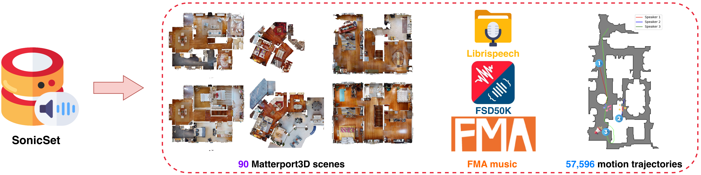
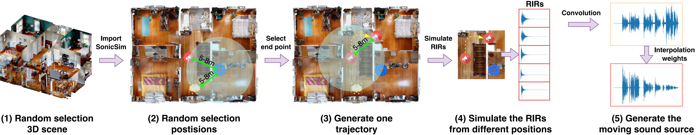
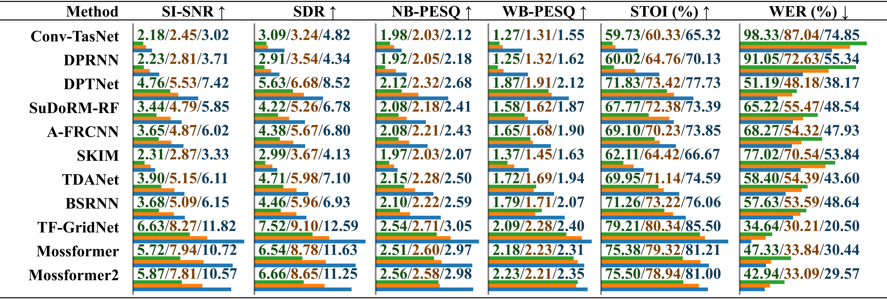
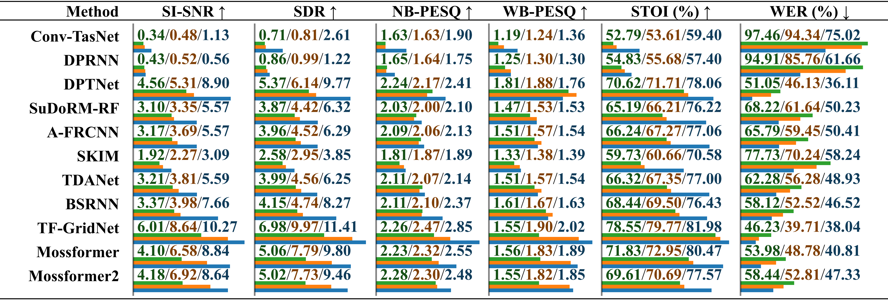
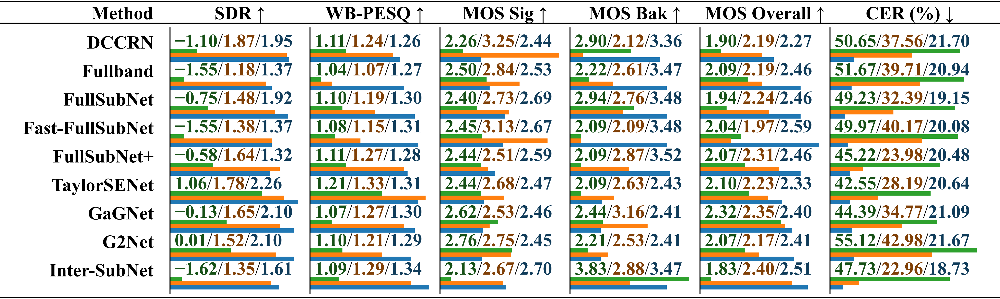
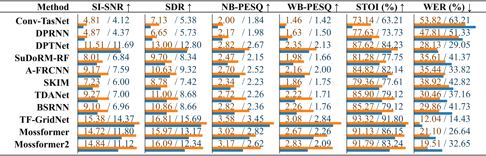
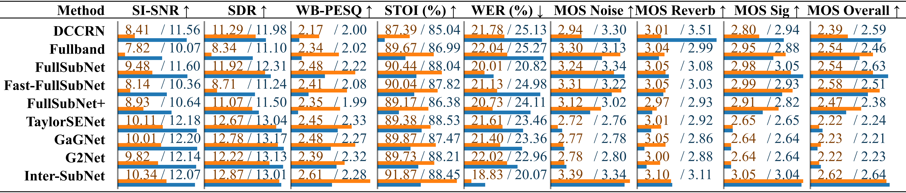

<p align="center">
  
</p>
<p align="center">
  <strong>Kai Li<sup>1</sup>, Wendi Sang<sup>1</sup>, Chang Zeng<sup>2</sup>, Runxuan Yang<sup>1</sup>, Guo Chen<sup>1</sup>, Xiaolin Hu<sup>1</sup></strong><br>
    <strong><sup>1</sup>Tsinghua University, China</strong><br>
    <strong><sup>2</sup>National Institute of Informatics, Japan</strong><br>
  <a href="#">Paper (Coming soon)</a> | <a href="https://cslikai.cn/SonicSim/">Demo</a>

<p align="center">
  
  
  
</p>

<p align="center">


# SonicSim: A customizable simulation platform for speech processing in moving sound source scenarios

We introduce SonicSim, a synthetic toolkit designed to generate highly customizable data for moving sound sources. SonicSim is developed based on the embodied AI simulation platform, Habitat-sim, supporting multi-level parameter adjustments, including scene-level, microphone-level, and source-level, thereby generating more diverse synthetic data. Leveraging SonicSim, we constructed a moving sound source benchmark dataset, SonicSet, using the LibriSpeech dataset, the Freesound Dataset 50k (FSD50K) and Free Music Archive (FMA), and 90 scenes from the Matterport3D to evaluate speech separation and enhancement models. 

## 🔥 News

- [2024-10-01] We release the [Real-world speech separation dataset](#real-world-data), which aims to evaluate the performance of speech separation models in real-world scenarios.

- [2024-07-31] We release the `SonicSim dataset`, which includes speech separation and enhancement tasks.

- [2024-07-24] We release the scripts for `dataset construction` and the [pre-trained models](https://github.com/JusperLee/SonicSim/releases/tag/v1.0) for `speech separation and enhancement`.

##  SonicSim Platform


-	3D Scene Import: Supports importing a variety of 3D assets from datasets like Matterport3D, enabling efficient and scalable generation of complex acoustic environments.

-	Acoustic Environment Simulation:
	1.	Simulates sound reflections within room geometries using indoor acoustic modeling and bidirectional path tracing algorithms.
	2.	Maps semantic labels of 3D scenes to material properties, setting the absorption, scattering, and transmission coefficients of surfaces.
	3.	Synthesizes moving sound source data based on source paths, ensuring high fidelity to real-world conditions.

-	Microphone Configurations: Offers a wide range of microphone setups, including mono, binaural, and Ambisonics, along with support for custom linear and circular microphone arrays.

-	Source and Microphone Positioning: Provides customization or randomization of sound source and microphone positions. Supports motion trajectories for moving sound source simulations, adding realism to dynamic acoustic scenarios.

##  SonicSet Dataset



You can download the pre-constructed dataset from the following link:

### 🔈 Speech Separation and 🔕 Speech Enhancement

| Dataset Name | Onedrive | Baidu Disk |
|-----|-----|-----|
| train folder (40 split rar files, 377G) | [[Download Link](https://1drv.ms/f/c/ba3b81b8a2ef83ae/EsO9TFmnSdNMohY3fYYQu7YBV8LasO-EmkpKEN10dXAl7g?e=n4z3io)] | [[Download Link](https://pan.baidu.com/s/1gC2LVErchEkO7ENdNOIb0A?pwd=c9gw)] |
| val.rar (4.9G) | [[Download Link](https://1drv.ms/u/c/ba3b81b8a2ef83ae/EX9938DRcx5NhfMfKdNq6NgBVcRdNnjF4syTWhetGa8sew?e=EnEtVn)] | [[Download Link](https://pan.baidu.com/s/11oybiPkFwihj9DZI0H_-vw?pwd=j36i)] |
| test.rar (2.2G) | [[Download Link](https://1drv.ms/u/c/ba3b81b8a2ef83ae/EeyzjZ9MgeJJsmAfdGTyGCEBMBtwjamGIDLkNLVMU1t2_w?e=KNJRoM)] | [[Download Link](https://pan.baidu.com/s/1GEcvmOs0VyP23v5gBfGREg?pwd=pyyf)] |
| sep-benchmark data (8.57G) | [[Download Link](https://1drv.ms/f/c/ba3b81b8a2ef83ae/EvDfTqiuSUxCrLKKcFpfGfIBeIgIvHuQkiuvcGBPjplcFg?e=ZeD7Kj)] | [[Download Link](https://pan.baidu.com/s/11oJ457YTA91gDgsVlWlaJA?pwd=kq79)] |
| enh-benchmark data (7.70G) | [[Download Link](https://1drv.ms/f/c/ba3b81b8a2ef83ae/EmMlMKMYRIVOiYQrRbHIU5wBt52R-Ej5-KdUuzZWsOFb0Q?e=pi05ve)] | [[Download Link](https://pan.baidu.com/s/15QHCdVwhTL_UipvgwAxLCg?pwd=x46b)] |

### Real-world data

#### 🔈 Speech Separation

| Dataset Name | Onedrive | Baidu Disk |
|-----|-----|-----|
| Real-world dataset (1.0G) | [[Download Link](https://1drv.ms/u/c/ba3b81b8a2ef83ae/Ea4qbfaHsgdNlG2Me7kiinoB-3jmQpyDSarRlgqjDSntZQ?e=5cDUza)] | [[Download Link](https://pan.baidu.com/s/1puhidhScf3j_KHlPAc3Vyg?pwd=amhx)] |

#### 🔕 Speech Enhancement

- RealMAN dataset: [RealMAN](https://github.com/Audio-WestlakeU/RealMAN/tree/main?tab=readme-ov-file)

##  Dataset Construction



To construct the dataset yourself, please refer to the README in the `SonicSim-SonicSet/data-script` folder. This document provides detailed instructions on how to use the scripts provided to generate the dataset.

## 🕹️ Environment Setup for Training and Inference

### Conda Environment Setup

To set up the environment for training and inference, use the provided YAML file:

```bash
conda env create -f SonicSim/torch-2.0.yml
conda activate SonicSim
```

### Download Checkpoints

Please check the contents of README.md in the [sep-checkpoints](https://github.com/JusperLee/SonicSim/tree/main/sep-checkpoints) and [enh-checkpoints](https://github.com/JusperLee/SonicSim/tree/main/enh-checkpoints) folders, download the appropriate pre-trained models in [Release](https://github.com/JusperLee/SonicSim/releases/tag/v1.0) and unzip them into the appropriate folders.

### Speech Separation Inference

Navigate to the `separation` directory and run the inference script with the specified configuration file:

```bash
cd separation
python inference.py --conf_dir=../sep-checkpoints/TFGNet-Noise/config.yaml
```

### Speech Enhancement Inference

Navigate to the `enhancement` directory and run the inference script with the specified configuration file:

```bash
cd enhancement
python inference.py --conf_dir=../enh-checkpoints/TaylorSENet-Noise/config.yaml
```

## 🏆 Results

### Comparison on real-recorded datasets

#### 🔈 Speech Separation


> Comparative performance evaluation of models trained on different datasets using real-recorded audio with **environmental noise**. The results are reported separately for <font color="2EA12E">“trained on LRS2-2Mix”</font>, <font color="FF8010">“trained on Libri2Mix”</font> and <font color="2178B4">“trained on SonicSet”</font>, distinguished by a slash. The relative length is indicated below the value by horizontal bars.


> Comparative performance evaluation of models trained on different datasets using real-recorded audio with **musical noise**. The results are reported separately for <font color="2EA12E">“trained on LRS2-2Mix”</font>, <font color="FF8010">“trained on Libri2Mix”</font> and <font color="2178B4">“trained on SonicSet”</font>, distinguished by a slash.

#### 🔕 Speech Enhancement


> Comparative performance evaluation of models trained on different datasets using the RealMAN dataset. The results are reported separately for <font color="2EA12E">“trained on VoiceBank+DEMAND”</font>, <font color="FF8010">“trained on DNS Challenge”</font> and <font color="2178B4">“trained on SonicSet”</font>, distinguished by a slash.

### Comparison on SonicSet datasets

We have trained separation and enhancement models on the SonicSet dataset. The results are as follows:

#### 🔈 Speech Separation (Only two speakers)

> Comparison of existing speech separation methods on the SonicSet dataset. The performance of each model is listed separately for results under <font color="FF8010">“environmental noise”</font> and <font color="2178B4">“musical noise”</font>, distinguished by a slash.

#### 🔕 Speech Enhancement


> Comparison of existing speech enhancement methods on theComparison of speech enhancement methods using the SonicSet test set. The metrics are listed separately under <font color="FF8010">“environmental noise”</font> and <font color="2178B4">“musical noise”</font>, distinguished by a slash.


## Acknowledgements

We would like to express our gratitude to the following:

- [LibriSpeech](http://www.openslr.org/12) for providing the speech data.
- [SoundSpaces](https://github.com/facebookresearch/sound-spaces) for the simulation environment.
- Apple for providing dynamic audio synthesis scripts.

## License


This work is licensed under a [Creative Commons Attribution-ShareAlike 4.0 International License](https://creativecommons.org/licenses/by-sa/4.0/).
